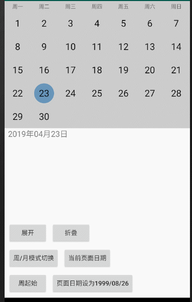
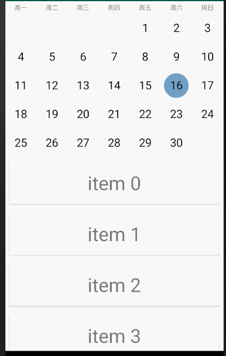

## 日历布局

一个可高度定制化的CalendarView

性能优越

## 引入

```
implementation 'tech.liujin:calendarView:1.0.3'
```

## 使用

```
<tech.threekilogram.calendar.CalendarView
    android:id="@+id/calendar"
    android:layout_width="match_parent"
    android:layout_height="400dp"
    app:layout_constraintEnd_toEndOf="parent"
    app:layout_constraintStart_toStartOf="parent"
    app:layout_constraintTop_toTopOf="parent">
</tech.threekilogram.calendar.CalendarView>
```




### 监听页面日期变化

```
mCalendar.setOnDateChangeListener( new OnDateChangeListener() {
      @Override
      public void onNewPageSelected ( Date date ) {
            mTextView.setText( CalendarUtils.getDateFormat( mCalendar.getCurrentPageDate() ) );
      }
      @Override
      public void onNewDateClick ( Date newDate ) {
            mTextView.setText( CalendarUtils.getDateFormat( mCalendar.getCurrentPageDate() ) );
      }
      @Override
      public void onNewDateSet ( Date date ) {
            mTextView.setText( CalendarUtils.getDateFormat( mCalendar.getCurrentPageDate() ) );
      }
} );
```


### 监听页面高度变化

```
final MonthLayout monthLayout = mCalendar.getMonthLayout();
monthLayout.setPageHeightChangeStrategy( new PageHeightChangeStrategy() {
      @Override
      public void onHeightChanging ( int currentHeight, int which ) {
            monthLayout.reLayoutToPageHeight( currentHeight );
            mTextView.setY( monthLayout.getBottom() );
      }
      @Override
      public void onScrollFinished ( ) {
            mTextView.setY( monthLayout.getBottom() );
      }
      @Override
      public void onExpanded ( ) {
      }
      @Override
      public void onFolded ( ) {
      }
} );
```

### 展开折叠

```
mCalendar.animateToMonthMode(); //展开
```

```
mCalendar.animateToWeekMode(); //折叠
```

### 改变周起始

```
mCalendar.setFirstDayMonday( !mCalendar.isFirstDayMonday() );
```

### 重设日期

```
mCalendar.setDate( CalendarUtils.get( 1999, 7, 26 ) );
```


### CoordinatorLayout中联动

```
<androidx.coordinatorlayout.widget.CoordinatorLayout
    xmlns:android="http://schemas.android.com/apk/res/android"
    xmlns:tools="http://schemas.android.com/tools"
    android:layout_width="match_parent"
    android:layout_height="match_parent"
    tools:context=".BehaviorTestActivity">

      <tech.threekilogram.calendar.CalendarView
          android:id="@+id/calendar"
          android:layout_width="match_parent"
          android:layout_height="350dp">
      </tech.threekilogram.calendar.CalendarView>

      <androidx.recyclerview.widget.RecyclerView
          android:id="@+id/recycler"
          android:layout_width="match_parent"
          android:layout_height="match_parent"
          >
      </androidx.recyclerview.widget.RecyclerView>
      
</androidx.coordinatorlayout.widget.CoordinatorLayout>
```

```
mCalendar = findViewById( R.id.calendar );
mRecycler = findViewById( R.id.recycler );
mRecycler.setLayoutManager( new LinearLayoutManager( this ) );
mRecycler.setAdapter( new Adapter() );
CalendarBehaviors mBehaviors = new CalendarBehaviors();
mBehaviors.setUpWith( mCalendar, mRecycler );
```



